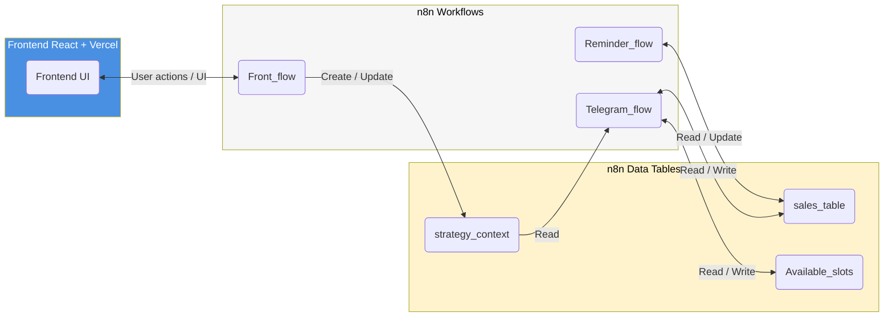
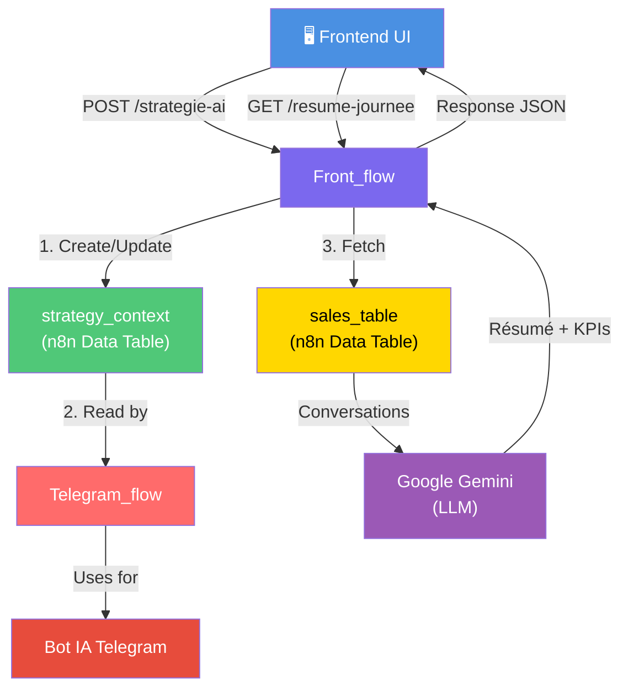

# 📊 N8N_FLOW.md – Workflows et flux de données

> Ce document détaille le fonctionnement des trois workflows n8n principaux : **Telegram_flow** (gestion des leads), **Reminder_flow** (relances automatiques) et **Front_flow** (création d'agents IA / lecture de résumé d'action de la journée).  
Chaque workflow est connecté aux tables de données n8n et synchronisé avec le frontend Vercel.

---

## 📋 Table des matières

1. [Vue d'ensemble](#1️⃣-vue-densemble-des-workflows)
2. [Telegram_flow - Qualification des leads](#2️⃣-telegram_flow--qualification-des-leads)
3. [Reminder_flow - Relances automatiques](#3️⃣-reminder_flow--relances-automatiques)
4. [Front_flow - Création d'agents IA](#4️⃣-front_flow--création-dagents-ia)
5. [Flux de données global](#5️⃣-flux-de-données-global)
6. [Troubleshooting](#6️⃣-troubleshooting)

---

## 1️⃣ Vue d'ensemble des workflows

### 🔄 Architecture générale



| Workflow | Déclencheur | Sortie | Tables | Intégration |
|----------|-------------|--------|--------|-------------|
| **Telegram_flow** | Message Telegram reçu | Conversation bot + Réservation | `sales_table`, `Available_slots`, `strategy_context` (lecture) | GoHighLevel CRM |
| **Reminder_flow** | Cron configurable | Message Telegram (relance) | `sales_table` | Telegram API |
| **Front_flow** | UI request (lecture) | Fournit configuration agent au frontend | `strategy_context` (lecture) | Frontend React |

---

## 2️⃣ Telegram_flow – Qualification des leads

### 📌 Objectif global

Le workflow **Telegram_flow** gère **entièrement la conversation avec le bot IA et le CRM GoHighLevel**.  
Le processus utilise des **tags de contact** pour orchestrer les étapes sans attendre de retour utilisateur, économisant ainsi les ressources n8n.

**Flux nominal** :  
Trigger → Initialisation → Qualifications progressives → Prise de rendez-vous → Clôture  
**Flux alternatif** :  
À chaque étape, si le lead n'est pas qualifié → **Process Downsell**

---

### 🎨 Structure par zones de couleur

#### 🔴 Zone ROUGE – Déclencheur & Initialisation

**Étapes** :
1. ✅ **Réception du message Telegram**
   - Le webhook Telegram déclenche le workflow
   - Extraction de : `user_id`, `chat_id`, `message_text`, `timestamp`

2. ✅ **Création/Récupération du contact GHL**
   - Vérification si contact existe dans GoHighLevel via `chat_id`
   - Si absent → Création du contact avec infos de base
   - Si présent → Récupération de l'historique et des tags

3. ✅ **Initialisation des variables globales**
   - `contact_key` : Identifiant unique du contact
   - `current_strategy` : Récupération du contexte agent IA depuis `strategy_context` table
   - `tags` : Tags GHL pour connaitre l'étape suivante

---

#### 🟡 Zone JAUNE – Étapes de qualification progressives

Les zones jaunes représentent les **5 étapes du processus de qualification**, du haut vers le bas :

---

##### **Étape 1️⃣ : Initialisation de la conversation**

**Nœud** : `Initialize Conversation`

- 🎯 Objectif : Engager le lead et collecter des informations initiales

**Données stockées** :
- Message utilisateur → `sales_table` (colonne `message`)
- Direction → `sales_table` (colonne `direction` = "inbound")
- Source → `sales_table` (colonne `source` = "Telegram")

---

##### **Étape 2️⃣ : Première qualification – Éligibilité du lead**

**Nœud** : `is_qualified` (Switch Node)

**Logique** : Vérifier si le lead correspond au **profil cible** défini dans `strategy_context`.

- ✅ **Qualifié** → Continuer vers l'étape 3
- ❌ **Non qualifié** → Redirection vers **Process Downsell** (zone bleue)

**Critères** :
- Secteur d'activité compatible
- Critère de qualificatin du client

**Appel IA** : Google Gemini 2.0 Flash analyse le message utilisateur et qualifie l'utilisateur selon les critères.

---

##### **Étape 3️⃣ : Mise à jour du contact – Complément d'information**

**Nœud** : `Edit Fields`

**Logique** : Enrichir le profil du contact avec des données utiles pour la réunion client.

- 📋 Extraction des informations
- 🔄 Mise à jour dans GoHighLevel CRM
- 💾 Stockage dans `sales_table` (colonnes : `name`, `email`, `phone`)

---

##### **Étape 4️⃣ : Proposition de vidéo éducative**

**Nœud** : `is_interested_by_video` (Switch Node)

**Logique** : Proposer une vidéo YouTube gratuite qui répond à la problématique du lead.

- 📺 Recherche d'une vidéo pertinente depuis YouTube
- 💬 Envoi du lien + invitation à regarder

**Deux cas** :
- ✅ **Lead accepte la vidéo** → Continuer vers l'étape 5
- ❌ **Lead refuse** → Redirection **Process Downsell** (zone bleue)

---

##### **Étape 5️⃣ : Deuxième qualification – Intérêt produit**

**Nœud** : `is_interested_by_book` (Switch Node)

**Logique** : Évaluer l'intérêt réel du lead pour le produit/service client.

- 📚 Proposition d'une ressource complémentaire
- 🎯 Évaluer la motivation et l'engagement

**Deux cas** :
- ✅ **Lead intéressé** → Continuer vers l'étape 6
- ❌ **Lead pas convaincu** → Redirection **Process Downsell** (zone bleue)

---

##### **Étape 6️⃣ : Troisième qualification – Investissement en temps**

**Nœud** : `is_not_a_free_slot` (logique inversée)

**Logique** : Vérifier si le lead est **disposé à investir du temps** pour se former/découvrir le produit.

- 🎯 Évaluer l'engagement réel vs l'intérêt superficiel

**Deux cas** :
- ✅ **Lead prêt à s'investir** → Continuer vers l'étape 7
- ❌ **Lead pas disponible** → Redirection **Process Downsell** (zone bleue)

---

##### **Étape 7️⃣ : Quatrième qualification – Investissement monétaire**

**Nœud** : `is_ROI_declined` (Switch Node)

**Logique** : Évaluer la **confiance financière** du lead dans l'investissement proposé.

- 🤔 Évaluer si le lead a le capital ET la confiance pour investir

**Deux cas** :
- ✅ **Lead confiant & capable** → Continuer vers l'étape 8 (Prise RDV)
- ❌ **Lead hésitant** → Redirection **Process Downsell** (zone bleue)

---

#### 🟢 Zone VERTE – Prise de rendez-vous (Processus de conversion)

**Nœud** : `booking_switch` + `Store slots`

**Objectif** : Conclure avec la **réservation d'un créneau**.

---

##### **Processus de prise de RDV**

**Étape 8️⃣ : Interprétation du langage naturel**

- 🤖 Interprétation du langage humain du lead
- 📅 Extraction des préférences : jour, heure
- 🔄 Comparaison avec les créneaux disponibles dans `Available_slots` table

**Logique complexe** :
```
SI lead propose un créneau compatible
  → Confirmer et réserver
SINON SI lead montre du désintérêt
  → Workflow tente de convaincre le lead de prendre un rdv
SINON SI lead n'a pas d'idée
  → Bot propose les 30 premiers créneaux libres
```

---

##### **Étape 9️⃣ : Stockage du rendez-vous**

**Nœud** : `Store slots`

**Mise à jour GoHighLevel** :
- ✅ Création du rendez-vous dans le calendrier
- ✅ Envoi d'une confirmation SMS/Telegram au lead

---

#### 🔵 Zone BLEUE – Process Downsell

**Objectif** : Si le lead échoue l'une des qualifications → **Fournir le maximum d'information au client** pour qu'il contacte manuellement le lead.

##### **Logique Downsell**

Redirection vers cette zone si :
- ❌ Lead non éligible
- ❌ Lead refuse la vidéo
- ❌ Lead pas intéressé
- ❌ Lead pas disponible
- ❌ Lead pas confiant financièrement

**Actions dans le process Downsell** :

1. ✅ **Compilation d'un dossier complet**
   - Historique complet de la conversation
   - Problématiques identifiées
   - Raison(s) de l'échec qualification

2. ✅ **Envoi au client**
   - Creation d'une tache dans GHL avec deadline à date + 3jours.

3. ✅ **Récupération du lead par humain**
   - Informations du lead dans sa fiche contact

---

### 🔗 Connecteurs de données

Voir [N8N_DEPENDENCIES.md](./dependend_tables/N8N_DEPENDENCIES.md)

### 🔌 Intégrations externes

| Service | Rôle |
|---------|------|
| **GoHighLevel CRM** | Gestion contacts + calendrier + taches |
| **Telegram API** | Envoi/réception messages bot |
| **Google Gemini 2.0 Flash** | Analyse messages + qualification + interprétation langage naturel |
| **YouTube API** | Recherche vidéos d'une ou plusieurs chaines données ***(en attente connecteur n8n)**|

---

## 3️⃣ Reminder_flow – Relances automatiques

### 📌 Objectif

Envoyer une **relance automatique** aux leads qui n'ont pas répondu après un **délai configurable**, via un message Telegram personnalisé.

---

### ⚙️ Configuration du déclencheur

Le workflow s'exécute via un **Schedule Trigger configurable** :

| Paramètre | Valeur par défaut | Modifiable ? |
|-----------|------------------|-------------|
| **Heure d'exécution** | 09h30 | ✅ Oui |
| **Fréquence** | Quotidienne (tous les jours) | ✅ Oui |
| **Délai relance** | 3 jours | ✅ Oui |

---

### 🔧 Comment modifier l'horaire de relance ?

**Via le dashboard n8n** :

<span style="color:red">*A l'heure actuelle il faut le faire dans le flow n8n directement, dans la v1 il est prévu de modifier ces parametres depuis le Front.*</span>
1. 🔗 Aller à **https://iadventure.app.n8n.cloud**
2. 📂 Sélectionner le workflow **"Relance 3 jours (LLM + Telegram + Data Tables)"**
3. 🎯 Cliquer sur le nœud **"Schedule Trigger"**
4. ⏰ **Modifier l'heure** dans le champ "Trigger at hour"
   - Format : `HH:MM` (ex: `14:30` pour 14h30)
   - Timezone : UTC (adapter selon votre fuseau horaire)

5. 💾 Cliquer sur **"Save"**
6. ✅ Workflow sauvegardé automatiquement

**Exemples de configuration** :

| Cas d'usage | Configuration |
|-------------|---------------|
| Relance le matin tôt | 06:00 |
| Relance en fin de matinée | 11:00 |
| Relance l'après-midi | 14:30 |
| Relance en fin de journée | 17:00 |

---

### 🔄 Processus de relance

| Étape | Description | Données |
|-------|-------------|---------|
| 🕐 **1. Schedule Trigger** | Exécution à l'heure configurée | Configurable |
| 📊 **2. Get row(s)** | Récupérer toutes les conversations `sales_table` | Filter : `direction = "inbound"` |
| 🔍 **3. Pick delay-based leads** | Filtrer : leads sans réponse depuis le délai configuré | Condition : `now() - last_message_date > [délai]` |
| 📝 **4. Structure message** | Construire message relance personnalisé | Contexte : `contact_name`, `conversation_summary` |
| 💬 **5. Telegram Send Message** | Envoyer le message via Telegram | API Telegram avec `chat_id` |
| ✅ **6. Update row** | Marquer le lead comme "relancé" | Insertion de la réponse d'un "AgentIA" dans la conversation |

---

### 📌 Règles d'exécution

- ✅ Exécution **une seule fois par jour** à l'heure configurée
- ✅ Relance **après le délai configuré** de silence (défaut : 3 jours)
- ✅ **Maximum 3 relance** par lead 
- ✅ Pas de relance si lead a déjà un RDV confirmé

---

## 4️⃣ Front_flow – Création d'agents IA

### 📌 Objectif global

Le workflow **Front_flow** expose deux endpoints qui permettent au frontend React de :
1. **Créer ou mettre à jour** des agents IA personnalisés
2. **Récupérer un résumé** des conversations du jour

Ces agents IA servent à **configurer le comportement du bot Telegram** pour chaque client ou cas d'usage.

---

### 🔗 Endpoint 1️⃣ : `/strategie-ai` (POST/PUT)

#### **Objectif**
Créer ou mettre à jour un **agent IA personnalisé** stocké dans la table `strategy_context`.

#### **Payload reçu (exemple)**

```json
POST https://iadventure.app.n8n.cloud/webhook/strategie-ai

{
  "agent_name": "Solar Agent v1",
  "sector": "immobilier",
  "context": "Prospection de leads immobiliers spécialisés en énergie solaire",
  "prompt": "Tu es un expert en installation solaire résidentielle..."
}
```

---

#### **Paramètres**

| Paramètre | Type | Requis | Description |
|-----------|------|--------|-------------|
| `agent_name` | string | ✅ Oui | Nom unique de l'agent (clé d'identification) |
| `sector` | string | ✅ Oui | Secteur d'activité cible |
| `context` | string | ✅ Oui | Description du contexte et de la mission de l'agent |
| `prompt` | string | ✅ Oui | Instructions système pour Google Gemini |

> 🔴 **Note V0** : Les sliders `qualification` et `objection` ne sont **pas utilisés** en v0 car non nécessaires pour le client actuel. Cette fonctionnalité sera implémentée en **v1.X**.

---

#### **Comportement**

**Si l'agent existe (même `agent_name`)** :
- ✅ **Mise à jour** des colonnes existantes dans `strategy_context`
- 🔄 Reste **actif automatiquement**
- ✅ **Utilisé immédiatement** par Telegram_flow pour les nouvelles conversations

**Si l'agent n'existe pas** :
- ✅ **Création** d'une nouvelle ligne dans `strategy_context`
- 🔄 Devient **actif automatiquement**

**Note importante**
- ⚠️ En **V0** : Seul le **premier agent créé** est utilisé par Telegram_flow
- 📌 En **V1** : Un **MCP (Model Context Protocol)** sélectionnera dynamiquement le meilleur agent selon le contexte

---

#### **Processus n8n**

| Étape | Nœud n8n | Action |
|-------|----------|--------|
| 1️⃣ | `Receive Strategy` | Reçoit le webhook POST |
| 2️⃣ | `Insert row` | Insère/met à jour la ligne dans `strategy_context` |

---

### 🔗 Endpoint 2️⃣ : `/resume-journee` (GET)

#### **Objectif**
Récupérer un **résumé automatique des conversations du jour** (00:00 → 23:59) avec **KPIs clés**.

---

#### **Appel API (exemple)**

```
GET https://iadventure.app.n8n.cloud/webhook/resume-journee
```

> 🔴 **Note V0** : Le frontend n'est **pas encore relié** à cet endpoint. Intégration prévue en **V1**.

---

**Exemple de contenu du résumé généré** :

> *"Journée du 11 novembre 2025 :*
> *• 12 conversations engagées*
> *• 7 leads qualifiés (58% taux de qualification)*
> *• 3 rendez-vous confirmés*
> *• 2 leads en downsell (budget insuffisant)*
> *• Secteurs principaux : Immobilier (6), Agritech (4), SaaS (2)*"

---

#### **Processus n8n**

| Étape | Nœud n8n | Action |
|-------|----------|--------|
| 1️⃣ | `Receive GET` | Reçoit le webhook GET |
| 2️⃣ | `Get row(s)` | Récupère toutes les conversations de la journée depuis `sales_table` |
| 3️⃣ | `Parse conversation` | Structure les données pour le LLM |
| 4️⃣ | `Summarize (LLM)` | Google Gemini génère le résumé + KPIs |
| 5️⃣ | `Normalize summary` | Nettoie et formate la réponse |
| 6️⃣ | `Lynvia resume` | Retourne le résumé au frontend |

---

### 📊 Connecteurs de données

| Table n8n | Usage |
|-----------|-------|
| **strategy_context** | Stockage des agents IA créés depuis le frontend |
| **sales_table** | Source des conversations pour générer le résumé journalier |

---

### 🌍 Intégrations externes

| Service | Rôle |
|---------|------|
| **Frontend React** | Appelle POST `/strategie-ai` et GET `/resume-journee` |
| **Google Gemini 2.0 Flash** | Génère le résumé + extrait les KPIs |

---

### 🔄 Flux de données



---

## 5️⃣ Troubleshooting

### ⚠️ Problèmes courants et solutions

#### **Telegram_flow : Comportement LLM**
- Boucle lors de la prise de rendez-vous si l'utilisateur refuse de donner une indication sur un jour. => Fix prévu en v1
- Qualification automatique en downsell si l'utilisateur ne répond pas à la question. => Fix prévu en v1 (création d'une dérogation de route pour "forcer" l'utilisateur à répondre)

---

#### **Telegram_flow : Le bot ne répond pas**

| Symptôme | Cause | Solution |
|----------|-------|----------|
| Message Telegram reçu mais pas de réponse | Webhook Telegram non configuré | Vérifier URL webhook dans n8n Settings → Webhook |
| Bot répond après 30+ secondes | Timeout Telegram (30s limit) | Optimiser les appels (réduire token budget) |
| Erreur "Contact not found in GHL" | Contact inexistant dans GoHighLevel | Vérifier intégration GHL + credentials n8n |
| Bot répète la même question | Tag bloqué en base | Vérifier table `sales_table` → colonne `direction` mal mise à jour |

---

#### **Reminder_flow : Relances ne sont pas envoyées**

| Symptôme | Cause | Solution |
|----------|-------|----------|
| Pas de message à l'heure configurée | Schedule Trigger désactivé | Vérifier Schedule Trigger est **Active** |
| Horaire ne change pas après modification | Cache n8n non rafraîchi | Recharger la page ou redémarrer le workflow |
| Relance envoyée 2x au même lead | Tag `REMINDED` non appliqué | Vérifier dernière étape "Update row" existe + tag correctement écrit |
| Erreur "Aucun lead à relancer" | Pas de leads en attente depuis le délai configuré | Créer test lead manuellement OU modifier délai en `1 jour` pour test |

---

#### **Front_flow : Agent IA non créé**

| Symptôme | Cause | Solution |
|----------|-------|----------|
| Webhook POST retourne 404 | URL webhook incorrecte dans frontend | Vérifier URL dans `.env.local` : `VITE_N8N_WEBHOOK` |
| Agent créé mais Telegram_flow ne l'utilise pas | `strategy_context` ne synchronise pas | Vérifier la configuration du noeud dans Telegram_flow |

---

#### **Vérification rapide : workflow fonctionnel ?**

```
Checklist de validation :

✅ Étape 1 : Envoyer message test à bot Telegram
   → Vérifier réception n8n (Logs Telegram_flow)
   
✅ Étape 2 : Vérifier création contact dans GHL
   → Onglet Contacts GoHighLevel
   
✅ Étape 3 : Vérifier insertion conversation dans sales_table
   → n8n Data Tables → Onglet sales_table
   
✅ Étape 4 : Vérifier classification qualification (tag appliqué)
   → Logs Switch "is_qualified"
   
✅ Étape 5 : Vérifier RDV créé dans GoHighLevel calendar
   → GHL Calendar → Événement apparu ?
   
SI tous ✅ → Workflow OK
SI 1+ ❌ → Consulter section troubleshooting
```

---

**© 2025 Lynvia Connect – Tous droits réservés.**